## Escuela Colombiana de Ingeniería

---

## Arquitecturas de Software

---

### Juan David Zambrano Gonzalez

---

# Componentes y conectores - Parte I.

---

El ejercicio se debe traer terminado para el siguiente laboratorio (Parte II).

#### Middleware- gestión de planos.


## Antes de hacer este ejercicio, realice [el ejercicio introductorio al manejo de Spring y la configuración basada en anotaciones](https://github.com/ARSW-ECI/Spring_LightweightCont_Annotation-DI_Example).

### Taller – Principio de Inversión de dependencias, Contenedores Livianos e Inyección de dependencias.

## Parte I. Ejercicio básico.

Para ilustrar el uso del framework Spring, y el ambiente de desarrollo para el uso del mismo a través de Maven (y NetBeans), se hará la configuración de una aplicación de análisis de textos, que hace uso de un verificador gramatical que requiere de un corrector ortográfico. A dicho verificador gramatical se le inyectará, en tiempo de ejecución, el corrector ortográfico que se requiera (por ahora, hay dos disponibles: inglés y español).

1. Abra el los fuentes del proyecto en NetBeans.

	

2. Revise el archivo de configuración de Spring ya incluido en el proyecto (src/main/resources). El mismo indica que Spring buscará automáticamente los 'Beans' disponibles en el paquete indicado.

```java
<?xml version="1.0" encoding="UTF-8"?>
<beans xmlns="http://www.springframework.org/schema/beans"
       xmlns:xsi="http://www.w3.org/2001/XMLSchema-instance"
       xmlns:context="http://www.springframework.org/schema/context"

       xsi:schemaLocation="http://www.springframework.org/schema/beans http://www.springframework.org/schema/beans/spring-beans-4.2.xsd
          http://www.springframework.org/schema/context http://www.springframework.org/schema/context/spring-context-4.2.xsd">

    <context:component-scan base-package="edu.eci.arsw" />
    
</beans>

```
3. Haciendo uso de la [configuración de Spring basada en anotaciones](https://docs.spring.io/spring-boot/docs/current/reference/html/using-boot-spring-beans-and-dependency-injection.html) marque con las anotaciones @Autowired y @Service las dependencias que deben inyectarse, y los 'beans' candidatos a ser inyectadas -respectivamente-:

	* GrammarChecker será un bean, que tiene como dependencia algo de tipo 'SpellChecker'.
   

    * EnglishSpellChecker y SpanishSpellChecker son los dos posibles candidatos a ser inyectados. Se debe seleccionar uno, u otro, mas NO ambos (habría conflicto de resolución de dependencias). Por ahora haga que se use EnglishSpellChecker.
   
5.	Haga un programa de prueba, donde se cree una instancia de GrammarChecker mediante Spring, y se haga uso de la misma:

```java
public static void main(String[] args) {
    ApplicationContext ac=new ClassPathXmlApplicationContext("applicationContext.xml");
    GrammarChecker gc=ac.getBean(GrammarChecker.class);
    System.out.println(gc.check("la la la "));
}
```


6.	Modifique la configuración con anotaciones para que el Bean ‘GrammarChecker‘ ahora haga uso del  la clase SpanishSpellChecker (para que a GrammarChecker se le inyecte EnglishSpellChecker en lugar de  SpanishSpellChecker. Verifique el nuevo resultado.


## Parte II.

En este ejercicio se va a construír un modelo de clases para la capa lógica de una aplicación que permita gestionar planos arquitectónicos de una prestigiosa compañia de diseño. 


1. Configure la aplicación para que funcione bajo un esquema de inyección de dependencias, tal como se muestra en el diagrama anterior.


	Lo anterior requiere:

	* Agregar las dependencias de Spring.
	* Agregar la configuración de Spring.
	* Configurar la aplicación -mediante anotaciones- para que el esquema de persistencia sea inyectado al momento de ser creado el bean 'BlueprintServices'.

**Para habilitar la inyección de dependencias se agregaron las librerías de Spring Core y Spring Context en el pom.xml.**

    <dependency>
        <groupId>org.springframework</groupId>
        <artifactId>spring-context</artifactId>
        <version>4.2.4.RELEASE</version>
    </dependency>


**Esto permitió el uso de anotaciones como @Service, @Component, @Autowired, etc.**

**Se creó la clase de configuración con anotaciones:**

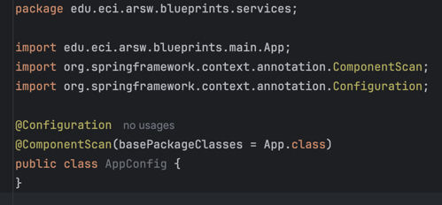

---
**@Configuration: indica que es una clase de configuración.**

---
**@ComponentScan: le dice a Spring en qué paquete buscar los beans (@Service, @Component).**

---
**Se configuró BlueprintsServices para que reciba automáticamente su dependencia de persistencia**
    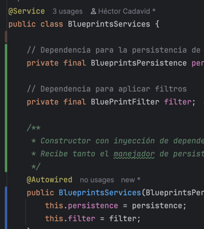

2. Complete los operaciones getBluePrint() y getBlueprintsByAuthor(). Implemente todo lo requerido de las capas inferiores (por ahora, el esquema de persistencia disponible 'InMemoryBlueprintPersistence') agregando las pruebas correspondientes en 'InMemoryPersistenceTest'.
---
   **Se implementaron usando el esquema de persistencia ya existente (InMemoryBlueprintPersistence).**
    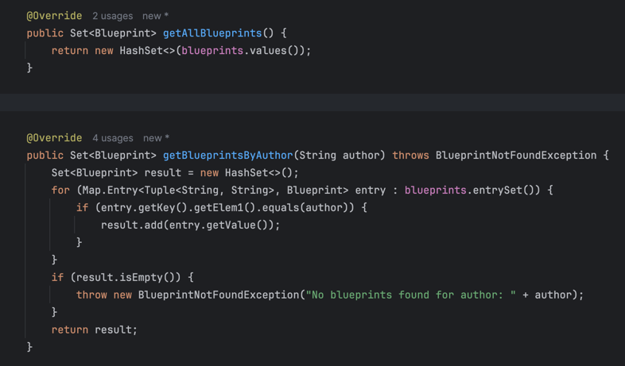
---
**Tests agregados en InMemoryPersistenceTest:**

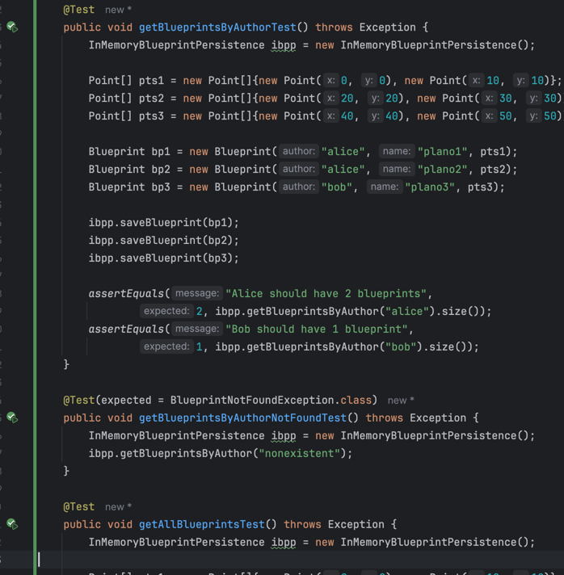
---
3. Haga un programa en el que cree (mediante Spring) una instancia de BlueprintServices, y rectifique la funcionalidad del mismo: registrar planos, consultar planos, registrar planos específicos, etc.
---
**Se creó un main donde Spring instancia el servicio automáticamente y se prueban operaciones:**

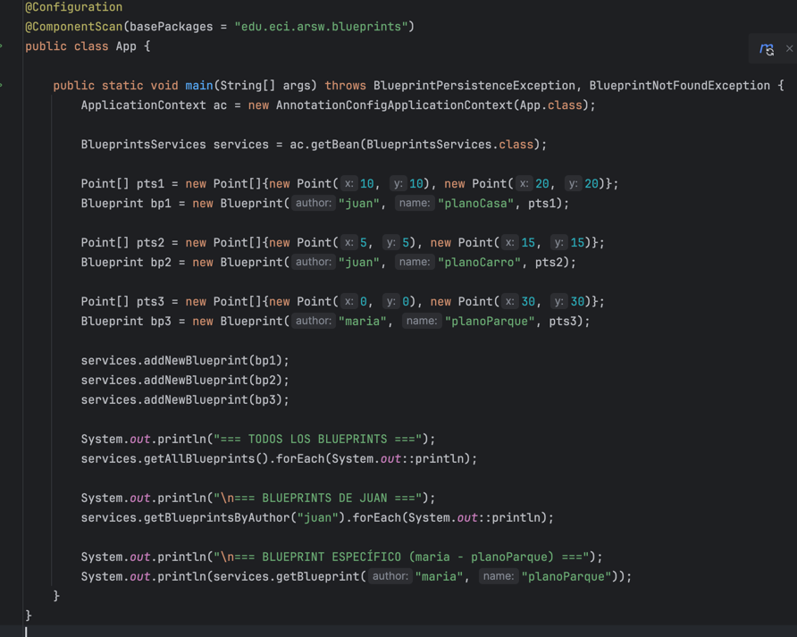

---
4. Se quiere que las operaciones de consulta de planos realicen un proceso de filtrado, antes de retornar los planos consultados. Dichos filtros lo que buscan es reducir el tamaño de los planos, removiendo datos redundantes o simplemente submuestrando, antes de retornarlos. Ajuste la aplicación (agregando las abstracciones e implementaciones que considere) para que a la clase BlueprintServices se le inyecte uno de dos posibles 'filtros' (o eventuales futuros filtros). No se contempla el uso de más de uno a la vez:
	* (A) Filtrado de redundancias: suprime del plano los puntos consecutivos que sean repetidos.
	* (B) Filtrado de submuestreo: suprime 1 de cada 2 puntos del plano, de manera intercalada.
---
**Se definio la interfaz (BluePrintFilter) y las dos implementaciones de los filtros (RedundancyFilter y SubsamplingFilter).**

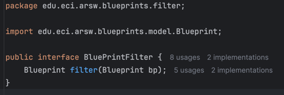

---

**RedundancyFilter**

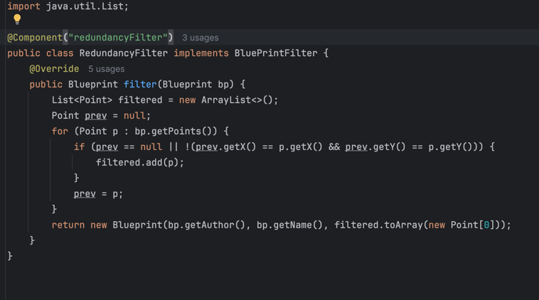

---

**SubsamplingFilter**

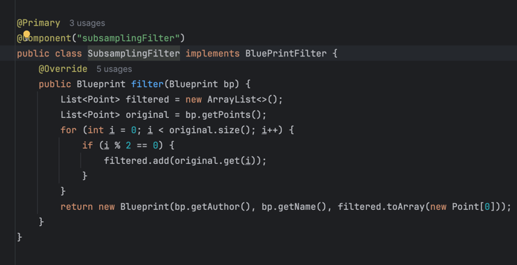


5. Agrege las pruebas correspondientes a cada uno de estos filtros, y pruebe su funcionamiento en el programa de prueba, comprobando que sólo cambiando la posición de las anotaciones -sin cambiar nada más-, el programa retorne los planos filtrados de la manera (A) o de la manera (B). 

---

**Se agrego la clase FiltersTest para hacer la respectivas pruebas a RedundancyFilter y SubsamplingFilter.**

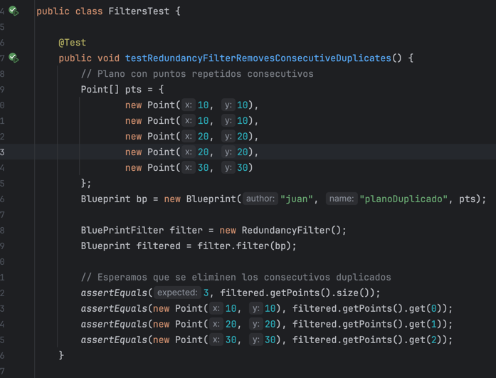

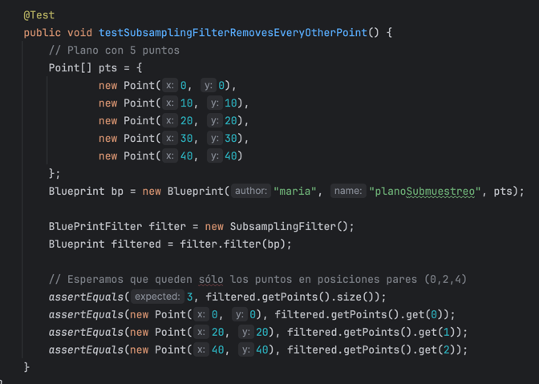

---

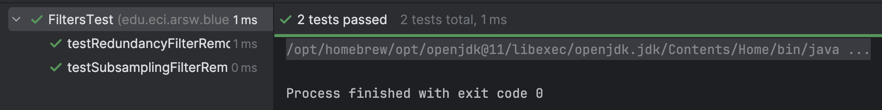